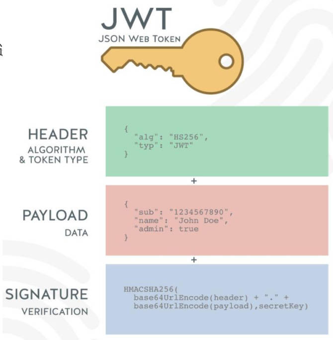

# 一、用户登录接口

## 1.服务器设置 cookie

在 Node 项目中，使用 *koa* 框架，为客户端（浏览器）设置 cookie。并设置过期时间。

Demo\02-服务器 cookie 设置.js

```js
const Koa = require('koa')
const KoaRouter = require('@koa/router')

// 创建 Koa 服务器
const app = new Koa()

// 创建路由对象
const userRouter = new KoaRouter({ prefix: '/users' })

// 在路由中，注册中间件
userRouter.get('/login', (ctx, next) => {
  // 在服务器中，为浏览器设置 cookie
  ctx.cookies.set('slogan', 'Never Mind the Scandal and Libel', {
    maxAge: 60 * 1000 * 5
  })

  ctx.body = '登录成功~'
})

userRouter.get('/list', (ctx, next) => {
  // 验证用户的登录凭证，即 cookie
  const value = ctx.cookies.get('slogan')
  console.log('value:', value)

  if (value === 'Never Mind the Scandal and Libel') {
    ctx.body = 'user list data~'
  } else {
    ctx.body = '没有权限访问用户列表，请先登录~'
  }
})

// 注册路由
app.use(userRouter.routes())
app.use(userRouter.allowedMethods())

// 开启 Koa 服务器
app.listen(9000, () => {
  console.log('koa 服务器启动成功~')
})
```

服务器为客户端（浏览器）设置 cookie 后，浏览器发送请求，会自动携带 cookie，前端不需要做任何操作。

总结：cookie 进行身份验证的步骤：

1. 服务器设置 cookie
2. 客户端（浏览器）获取服务器设置的 cookie，并保存在本地。
3. 在同一个域名/路径下，进行访问，会自动携带 cookie。
4. 服务器可以通过客户端携带的 cookie，验证用户的身份。

## 2.服务器设置 session

明文的 cookie，容易被伪造；

在开发中，一般使用 session

session 基于 cookie，做了加密的操作。

安装 _koa-session_ 库。

```shell
npm install koa-session
```

### 1.不“加盐”

仅会进行一次加密，容易伪造。

Demo\03-服务器 session 设置.js

```js
const session = koaSession(
  {
    key: 'sessionid',
    signed: false,
    maxAge: 60 * 1000 * 5
  },
  app
)
app.use(session)
```

生成如下凭证：

| name      | value                                                                                                                | ... |
| --------- | -------------------------------------------------------------------------------------------------------------------- | --- |
| sessionid | eyJzbG9nYW4iOiJOZXZlciBNaW5kIHRoZSBTY2FuZGFsIGFuZCBMaWJlbCIsIl9leHBpcmUiOjE2ODI3ODM1NjM5NzYsIl9tYXhBZ2UiOjMwMDAwMH0= | ... |

### 2.“加盐”操作

生成两个 cookie，进行双重认证，客户端不好伪造，因为不知道服务器加的盐是什么。

Demo\03-服务器 session 设置.js

```js
const Koa = require('koa')
const KoaRouter = require('@koa/router')
const koaSession = require('koa-session')

// 创建 Koa 服务器
const app = new Koa()

// 创建路由对象
const userRouter = new KoaRouter({ prefix: '/users' })

const session = koaSession(
  {
    key: 'sessionid',
    signed: true,
    maxAge: 60 * 1000 * 5
  },
  app
)
app.keys = ['aaa', 'bbb', 'zzt', 'kobe']
app.use(session)

// 在路由中，注册中间件
userRouter.get('/login', (ctx, next) => {
  ctx.session.slogan = 'Never Mind the Scandal and Libel'

  ctx.body = '登录成功~'
})

userRouter.get('/list', (ctx, next) => {
  // 验证用户的登录凭证，即 cookie
  const value = ctx.session.slogan
  console.log('value:', value)

  if (value === 'Never Mind the Scandal and Libel') {
    ctx.body = 'user list data~'
  } else {
    ctx.body = '没有权限访问用户列表，请先登录~'
  }
})

// 注册路由
app.use(userRouter.routes())
app.use(userRouter.allowedMethods())

// 开启 Koa 服务器
app.listen(9000, () => {
  console.log('koa 服务器启动成功~')
})
```

生成凭证如下：

| name          | value                                                                                                                | ... |
| ------------- | -------------------------------------------------------------------------------------------------------------------- | --- |
| sessionid.sig | zabSQNk7eUGFTNXvSaSKL_e3ZO0                                                                                          | ... |
| sessionid     | eyJzbG9nYW4iOiJOZXZlciBNaW5kIHRoZSBTY2FuZGFsIGFuZCBMaWJlbCIsIl9leHBpcmUiOjE2ODI4MjIxNTY0MTMsIl9tYXhBZ2UiOjMwMDAwMH0= |     |

## 3.cookie、session 缺点

一直以来的缺点：

Cookie 会被附加在每个 HTTP 请求中，无形地增加了流量（事实上某些请求是不需要的）；

Cookie 是明文传递的，所以存在安全性的问题；

Cookie 的大小限制是 4KB，对于复杂的需求来说，是不够的；

最主要的两个缺点：

对于浏览器以外的其他客户端，比如 iOS、Android，必须手动的设置 cookie 或 session，这是很麻烦的。

对于分布式系统、服务器集群来说，在不同的系统之间，正确的验证解析 session，是比较麻烦的。

> 分布式系统，将一个系统，按功能模块，分为若干个系统。

## 4.token 是什么？

进入移动互联网时代后，前后端分离的项目中，一般使用 token，来进行身份验证。

token 可以翻译为“令牌”；也就是在用户登录成功后，给用户颁发的一个令牌；

这个令牌，作为用户访问一些接口或者资源的凭证；根据这个凭证，来判断用户是否有权访问资源；

token 的使用应该分成两个重要的步骤：

1. 生成 token：用户在登录时，颁发 token；
2. 验证 token：用户在访问某些资源或者接口时，验证 token；

## 5.JWT 实现 token

**JWT 是指 json web token**；该方式生成的 token，由三部分组成：

header

- `alg`：采用的加密算法，默认是 _HMAC SHA256（HS256）_，默认采用**同一个密钥**进行加密和解密，即”对称加密“；
- `typ`：JWT，固定值，通常都写成 JWT 即可；
- 会通过 _base64Url_ 算法进行编码；

payload

- 携带的数据；
  - 比如：可将用户的 `id` 和 `name` 放到 payload 中；
- 默认也会携带 `iat（issued at）`，令牌的签发时间；
- 也可设置过期时间：`exp（expiration time`）；
- 会通过 _base64Url_ 算法进行编码

signature

- 设置一个 `secretKey`（默认使用对称加密），将前两部分（header、payload）的结果合并后，进行 *HMAC SHA256（HS256）*的算法；
  - `HMACSHA256(base64Url(header)+.+base64Url(payload), secretKey);`
- 一旦 `secretKey` 暴露出去，第三方就可以伪造颁发 token，也可以解密 token；这是非常危险的。



> “header”、“payload” 部分，可以被逆向解密出来。
>
> 因此，防止 token 被伪造，最重要的是 “signature” 部分。
>
> 在对称加密中，secretkey 一定要保管好，一旦泄露，第三方就能伪造 token 了。

### 1.对称加密

对称加密，在加密、解密的过程中，使用的是同一个密钥，即 `secretKey`。

安装一个库 _jsonwebtoken_

```shell
npm install jsonwebtoken
```

使用对称加密，生成一个 token。

> 在客户端，一般通过 _Bearer token_ 的形式，将 token 放入请求的 `header` 中，传递给服务器。

服务器拿到 token 后：

1. 验证有效性。

2. 验证 token 里的用户信息。

验证不通过，会抛出异常，使用 `try...catch` 包裹验证的过程。

Demo\04-对称加密 token 颁发和验证.js

```js
const Koa = require('koa')
const KoaRouter = require('@koa/router')
const jwt = require('jsonwebtoken')

// 创建 Koa 服务器
const app = new Koa()

// 创建路由对象
const userRouter = new KoaRouter({ prefix: '/users' })

const secretKey = 'aaabbbcccxxx'

// 在路由中，注册中间件
userRouter.get('/login', (ctx, next) => {
  // 1.颁发 token
  const payload = { id: 111, name: 'zzt' } // 模拟从数据库中，取出用户信息
  const token = jwt.sign(payload, secretKey, {
    expiresIn: 60 // 单位：秒
  })

  ctx.body = {
    code: 1,
    token,
    msg: '登录成功~'
  }
})

userRouter.get('/list', (ctx, next) => {
  // 1.获取客户端携带过来的 token
  const authorization = ctx.headers.authorization
  const token = authorization.replace('Bearer ', '')
  console.log('token:', token)

  // 2.验证 token
  try {
    const result = jwt.verify(token, secretKey)
    console.log('result:', result)
    // result: { id: 111, name: 'zzt', iat: 1682824424, exp: 1682824484 }

    // 模拟返回用户在客户端要访问的资源
    ctx.body = {
      code: 1,
      data: [
        { id: 111, name: 'zzt' },
        { id: 112, name: 'kobe' },
        { id: 113, name: 'lilei' }
      ]
    }
  } catch (err) {
    console.log('err:', err)
    ctx.body = {
      code: -1010,
      msg: 'token 过期或者无效~'
    }
  }
})

// 注册路由
app.use(userRouter.routes())
app.use(userRouter.allowedMethods())

// 开启 Koa 服务器
app.listen(9000, () => {
  console.log('koa 服务器启动成功~')
})
```

### 2.非对称加密

前面说过，_HS256_ 加密算法，一旦密钥（`secretKey`）暴露，是非常危险的：

然而，在分布式系统中，使用对称加密，

- 各个子系统，都要拿到这个密钥，才能验证用户信息；
- 意味着各个子系统，本质上，既可以发布令牌，也可以验证令牌；

事实上，在分布式系统中，

- 只有进行用户登录的系统，才需要有颁发令牌的的能力；
- 对于一些资源子系统来说，它们只需要有验证令牌的能力就可以了，

这个时候，可以使用非对称加密，_RS256_ 算法，来提高安全性，它需要用到：

- 私钥（private key）：用于颁发令牌；
- 公钥（public key）：用于验证令牌；
- 它们是**成对使用**的。

此时只要保证，存储私钥服务器的安全性，那么就是相对安全的。

那么，在分布式架构中，如下设计即可：

- 用户系统中，使用私钥颁发令牌；
- 在商品系统，订单系统...其它资源系统上，用公钥验证令牌。

使用 _openssl_ 来生成一对私钥、公钥：

- 先生成私钥，再利用生成的私钥，生成公钥。

> Mac 直接使用 terminal 终端即可；
>
> Windows 默认的 cmd 终端，是不能直接使用 openssl 的，建议使用 git bash 终端；

```shell
openssl
OpenSSL> genrsa -out private.key 2048
OpenSSL> rsa -in private.key -pubout -out public.key
```

使用 jwt 加密、解密时，传入 `RS256` 算法。

> 【注意】：对称加密用的是 **HS256 算法**，非对称加密要用 **RS256 算法**。

Demo\05-非对称加密 token 颁发和验证.js

```js
const fs = require('fs')
const Koa = require('koa')
const KoaRouter = require('@koa/router')
const jwt = require('jsonwebtoken')

// 创建 Koa 服务器
const app = new Koa()

// 创建路由对象
const userRouter = new KoaRouter({ prefix: '/users' })

// 读取公钥和私钥
const privateKey = fs.readFileSync('./keys/private.key')
const publicKey = fs.readFileSync('./keys/public.key')

// 在路由中，注册中间件
userRouter.get('/login', (ctx, next) => {
  // 1.颁发 token
  const payload = { id: 111, name: 'zzt' }
  // jwt.sign 支持传 buffer 类型
  const token = jwt.sign(payload, privateKey, {
    expiresIn: 60,
    algorithm: 'RS256'
  })

  ctx.body = {
    code: 1,
    token,
    msg: '登陆成功~'
  }
})

userRouter.get('/list', (ctx, next) => {
  // 1.获取客户端的 token
  const authorization = ctx.header.authorization
  const token = authorization.replace('Bearer ', '')
  console.log('token:', token)

  // 2.验证 token
  try {
    const result = jwt.verify(token, publicKey, {
      algorithms: ['RS256'] // 在数组中，可以放入多个算法，jwt 会一一尝试解密。
    })
    console.log('result:', result)

    ctx.body = {
      code: 1,
      data: [
        { id: 111, name: 'zzt' },
        { id: 112, name: 'kobe' },
        { id: 113, name: 'messi' }
      ]
    }
  } catch (err) {
    console.log('err:', err)
    ctx.body = {
      code: -1010,
      msg: 'token 过期或无效~'
    }
  }
})

// 注册路由
app.use(userRouter.routes())
app.use(userRouter.allowedMethods())

// 开启 Koa 服务器
app.listen(9000, () => {
  console.log('koa 服务器启动成功~')
})
```

## 6.在项目中实现

> 为 koaRouter 生成一个代码片段
>
> C:\Users\Zetian Zhu\AppData\Roaming\Code\User\snippets\javascript.json
>
> ```json
> {
>   "koa Router": {
>     "prefix": "koa-router",
>     "body": [
>       "const KoaRouter = require('@koa/router')",
>       "",
>       "const ${1:home}Router = new KoaRouter({ prefix: '/${1:home}' })",
>       "",
>       "module.exports = ${1:home}Router"
>     ],
>     "description": "koaRouter"
>   }
> }
> ```

在项目中，编写 `login.router.js`，在其中编写登录的服务。

src\router\login.router.js

```js
const KoaRouter = require('@koa/router')
const { login, test } = require('../controller/login.controller')
const { verifyLogin, verifyAuth } = require('../middleware/login.middleware')

const loginRouter = new KoaRouter({ prefix: '/login' })

loginRouter.post('/', verifyLogin, login)
loginRouter.get('/test-auth', verifyAuth, test)

module.exports = loginRouter
```

src\middleware\login.middleware.js

```js
const {
  NAME_OR_PASSWORD_IS_REQUIRED,
  NAME_IS_NOT_EXIST,
  PASSWORD_IS_INCORRENT,
  UNAUTHORIZATION,
  INVALID_AUTHORIZATION
} = require('../config/error')
const userService = require('../service/user.service')
const md5password = require('../utils/md5-password')
const { PUBLIC_KEY } = require('../config/secret')
const jwt = require('jsonwebtoken')

/**
 * @description: 此中间件用于：验证用户登录时的用户名和密码
 * @Author: ZeT1an
 * @param {*} ctx koa ctx
 * @param {*} next koa next
 * @return {*}
 */
const verifyLogin = async (ctx, next) => {
  const { name, password } = ctx.request.body

  // 1.判断用户名、密码是否为空
  if (!name || !password) {
    return ctx.app.emit('error', NAME_OR_PASSWORD_IS_REQUIRED, ctx)
  }

  // 2.查询该用户是否在数据库中存在
  const users = await userService.findUserByName(name)
  const user = users[0]
  if (!user) {
    return ctx.app.emit('error', NAME_IS_NOT_EXIST, ctx)
  }

  // 3.查询数据库中，密码和用户传递的密码，是否一致
  if (user.password !== md5password(password)) {
    return ctx.app.emit('error', PASSWORD_IS_INCORRENT, ctx)
  }

  // 4.将 user 对象，保存在 ctx 中
  ctx.user = user

  next()
}

module.exports = {
  verifyLogin
}
```

在 controller 层，处理用户登录，并颁发令牌：

src\controller\login.controller.js

```js
const { PRIVATE_KEY } = require('../config/secret')
const jwt = require('jsonwebtoken')

class LoginController {
  login(ctx, next) {
    // 1.获取用户信息
    const { id, name } = ctx.user

    // 2.颁发令牌
    const token = jwt.sign({ id, name }, PRIVATE_KEY, {
      expiresIn: 60 * 60 * 24,
      algorithm: 'RS256'
    })

    // 3.返回用户信息
    ctx.body = { code: 1, data: { id, name, token } }
  }
}

module.exports = new LoginController()
```

> 【注意】：在工程化的项目中，读取私钥，公钥时：
>
> - `fs.readFileSync(path)`中，`path` 是相对于项目启动目录（即项目根目录）的相对路径。
> - 也可用绝对路径，但是要写成：`path.resolve(__dirname, 'xxxx')`。

src\config\secret.js

```js
const fs = require('fs')
const path = require('path')

const PRIVATE_KEY = fs.readFileSync(path.resolve(__dirname, './keys/private.key'))
const PUBLIC_KEY = fs.readFileSync(path.resolve(__dirname, './keys/public.key'))

module.exports = {
  PRIVATE_KEY,
  PUBLIC_KEY
}
```
